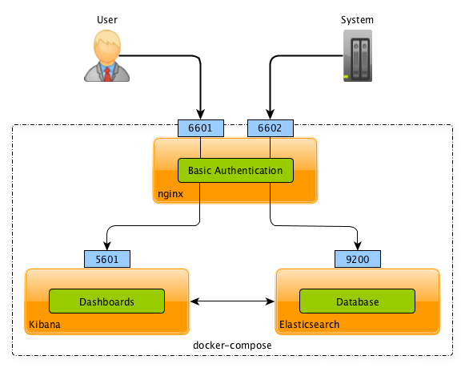
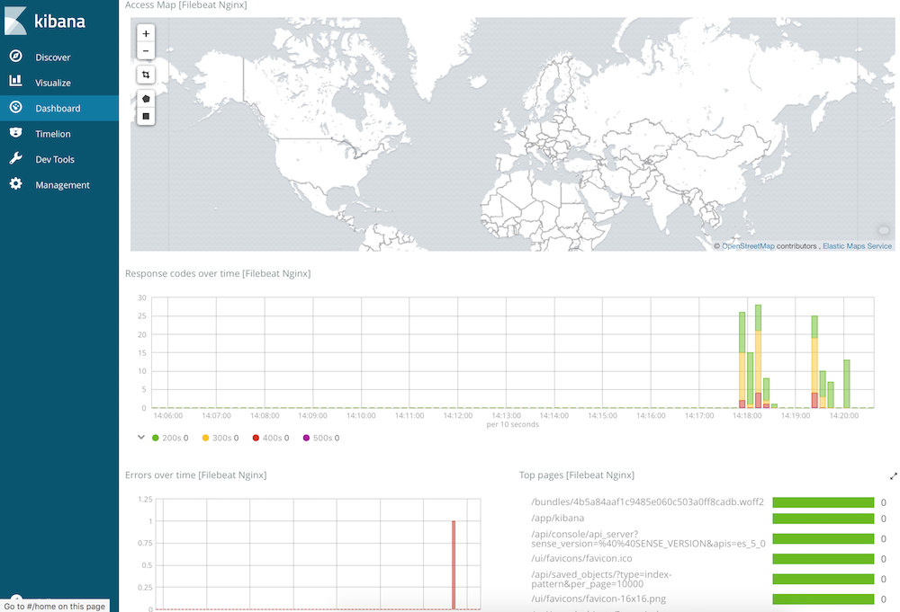

# How to create elasticsearch and kibana containers

## Architecture

This is a very simple configuration for Elasticsearch and Kibana with a basic authentication



**Elasticsearch version:** elasticsearch-oss:6.2.3
**Kibana version:** kibana-oss:6.2.3

## Preconfiguration

The `vm.max_map_count` kernel setting needs to be set to at least 262144 for production use. Depending on your platform:

The `vm.max_map_count` setting should be set permanently in `/etc/sysctl.conf`:

```console
grep vm.max_map_count /etc/sysctl.conf
vm.max_map_count=262144
```

In case if you don't see this line `vm.max_map_count=262144` you have to add it to `/etc/sysctl.conf`

To apply the setting on a live system type:

```console
sysctl -w vm.max_map_count=262144
```

Reboot the server to apply this parameter as a permanent setting

## Create docker-compose file

### 1\. Clone this repository

```git
git clone https://github.com/sharavara/elk.git
```

### 2\. Setup configuration in the file 'create-instance.sh'

You have to change these variables:

```bash
BASEDIR=~/docker/xyz-elk            # Folder for persistant data
CONF_INSTANCEPREFIX=xyz             # Containers' names will be xyz-esnode, xyz-kibana and xyz-nginx
CONF_SERVERNAME=vsbook.local        # server hostname
CONF_KIPORT=6601                    # kibana's port
CONF_ESPORT=6602                    # elasticsearch's port
CONF_TIMEZONE="TZ=Asia/Ho_Chi_Minh" # your timezone
ESADMIN=esadm                       # elasticsearch user
ESPASSWD=p@sswd                     # not longer that 8 characters
KIADMIN=kiadm                       # kibana user
KIPASSWD=p@sswd                     # not longer that 8 characters
FILEBEAT=false                      # filebeat container for ngnix monitoring and predefined dashboards
```

If a variable `FILEBEAT` is `true` this script will create an additional container with `filebeat:6.2.4` instance.
This instance will create default dashboadrs for the different systems and will start to collect logs from `nginx` container

### 3\. Run script `create-instance.sh` to setup configuration and start the containers

```console
chmod 750 create-instance.sh
./create-instance.sh
```

## Usefull commands

### Stop the containers

```console
  docker-compose stop
```

### Run the containers

```console
docker-compose up -d
```

### Restar the containers

```console
docker-compose restart
```

### Delete the containers

```console
docker-compose rm
```

Do not forget delete the persistent data if  it don't need you anymore.

## Default `nginx` dasboard



## Firewall

In case of the host with elasticsearch is unreachable then check the firewall settings

CentOS:

```console
sudo firewall-cmd --zone=public --add-port=6602/tcp
```